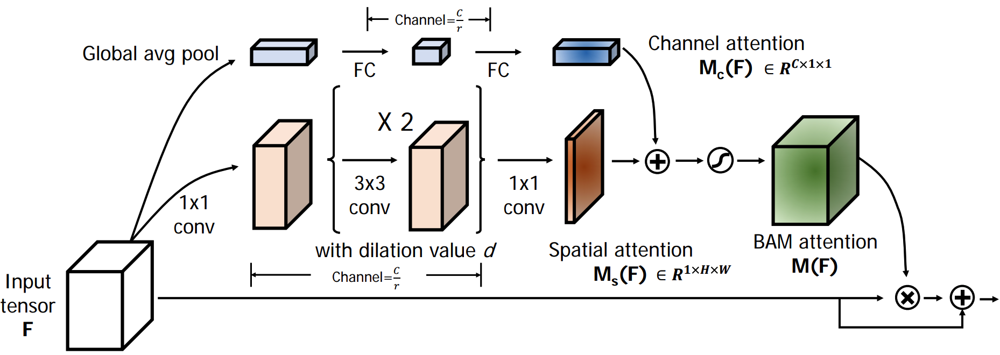

# Attention in CV

## [SGE](https://arxiv.org/pdf/1905.09646.pdf)

## [CBAM](https://arxiv.org/pdf/1807.06521.pdf)

## [SE](https://arxiv.org/pdf/1709.01507.pdf)

## [BAM](https://arxiv.org/pdf/1807.06514v1.pdf)

## [SK](https://arxiv.org/pdf/1903.06586.pdf)

## [SRM](https://arxiv.org/pdf/1903.10829.pdf)

## Other Papers：

[GCNet: GCNet: Non-local Networks Meet Squeeze-Excitation Networks and Beyond](https://arxiv.org/pdf/1904.11492.pdf), [code](https://github.com/xvjiarui/GCNet)

[Attention Is All You Need](https://arxiv.org/abs/1706.03762)  

[Spatial Transformer Networks](https://arxiv.org/abs/1506.02025) 

## Reference

https://github.com/implus/PytorchInsight

https://github.com/hekesai/CV_attention

https://gluon-cv.mxnet.io/model_zoo/classification.html

https://github.com/osmr/imgclsmob

https://github.com/EvgenyKashin/SRMnet
